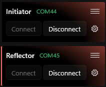
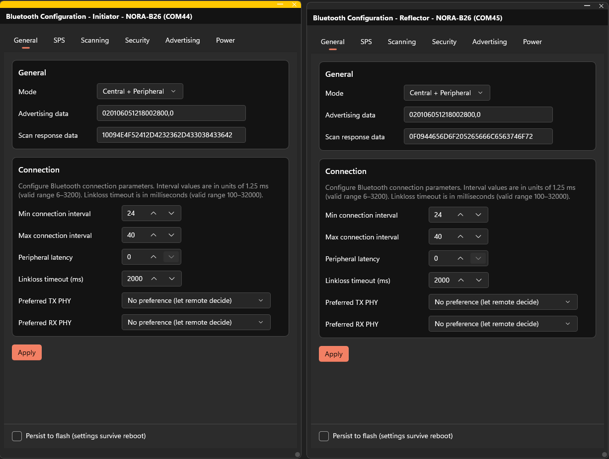
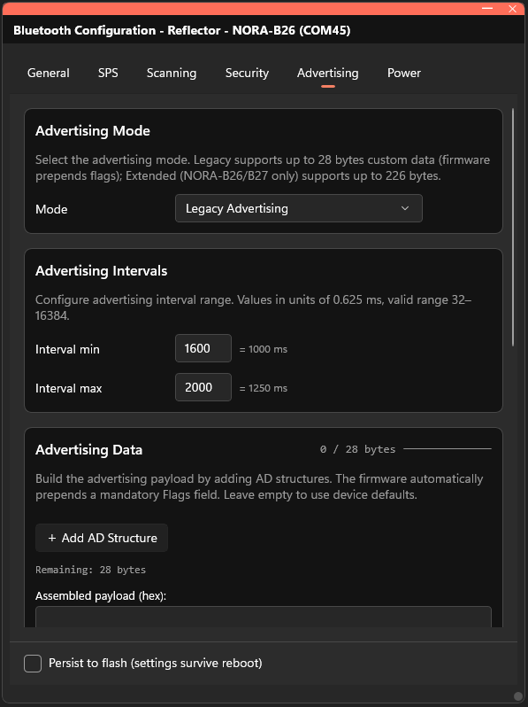
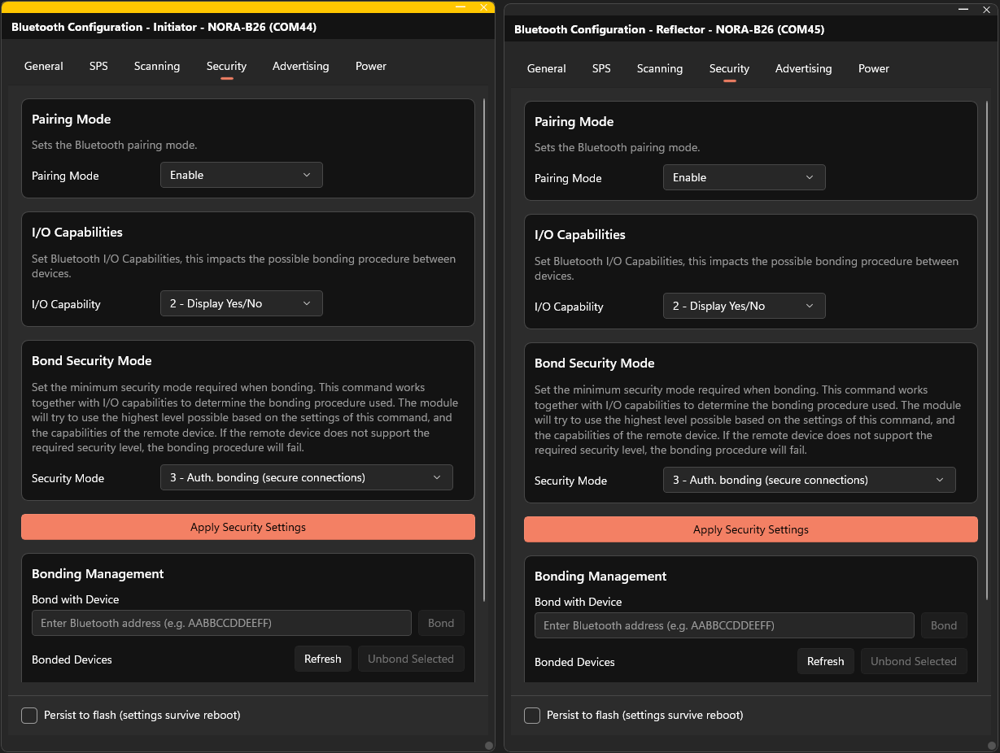
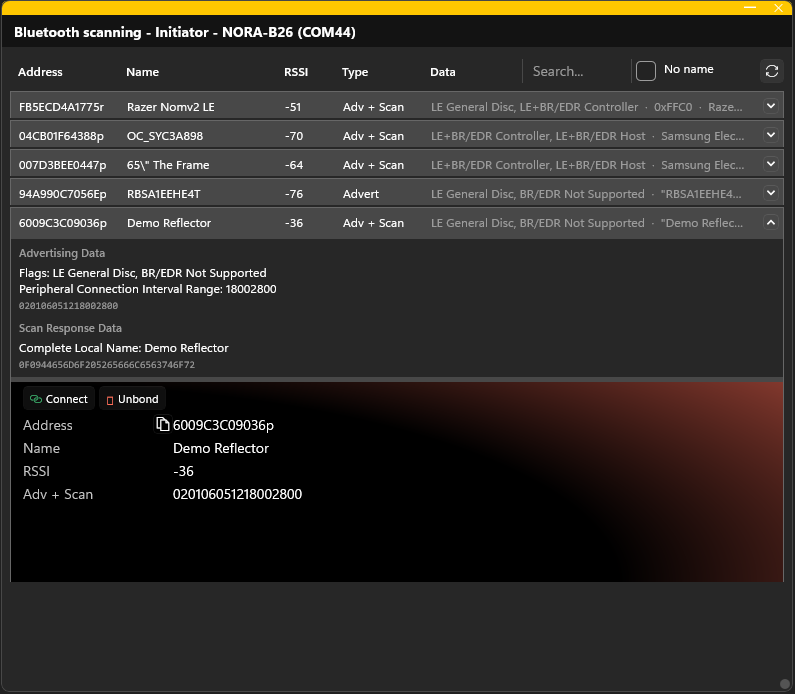
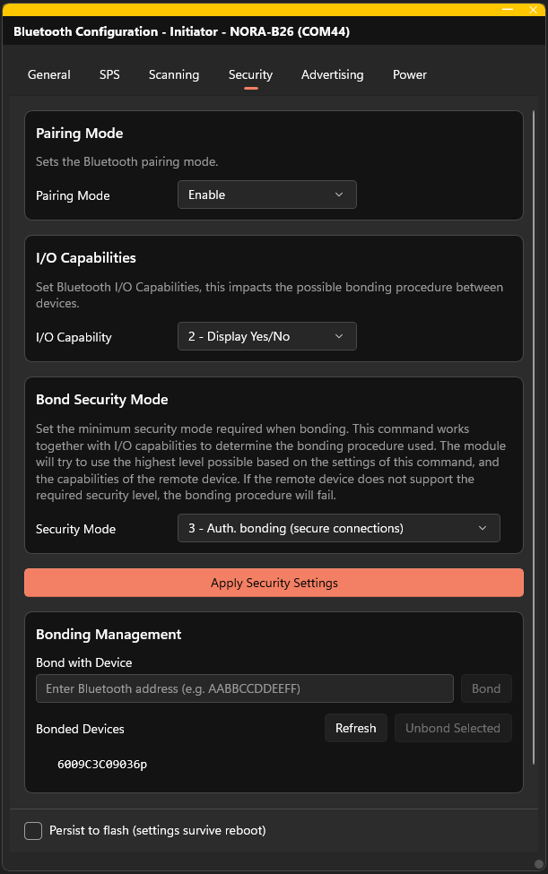
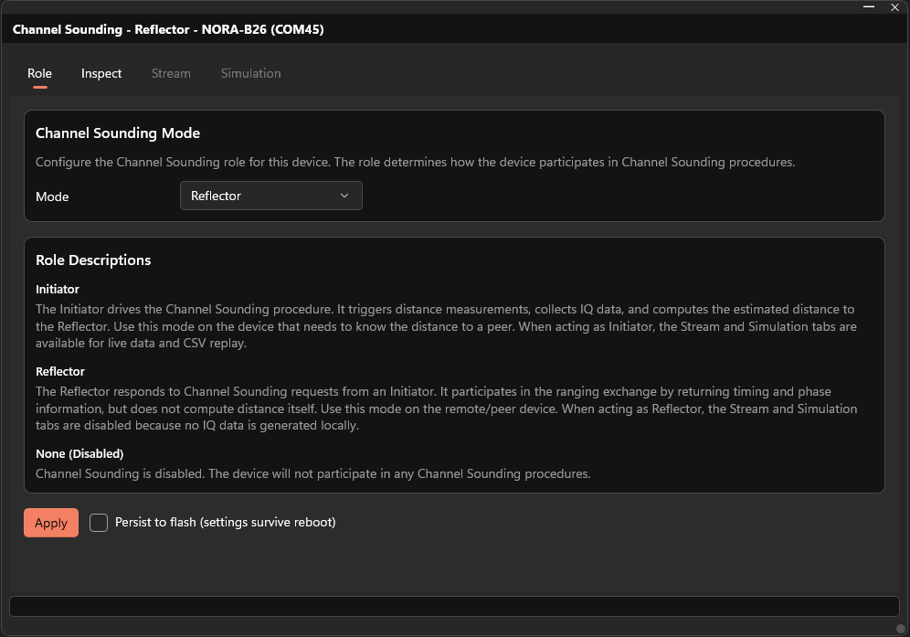
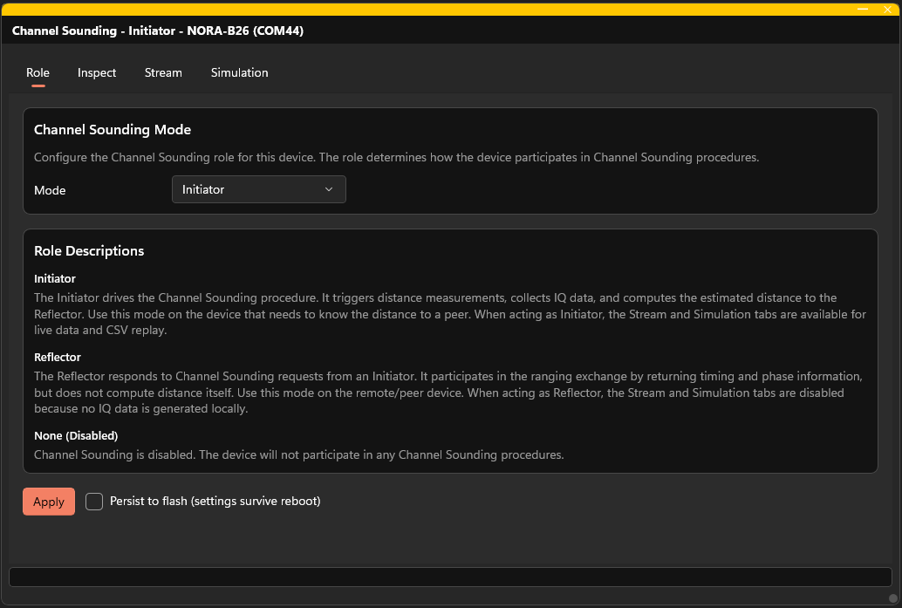
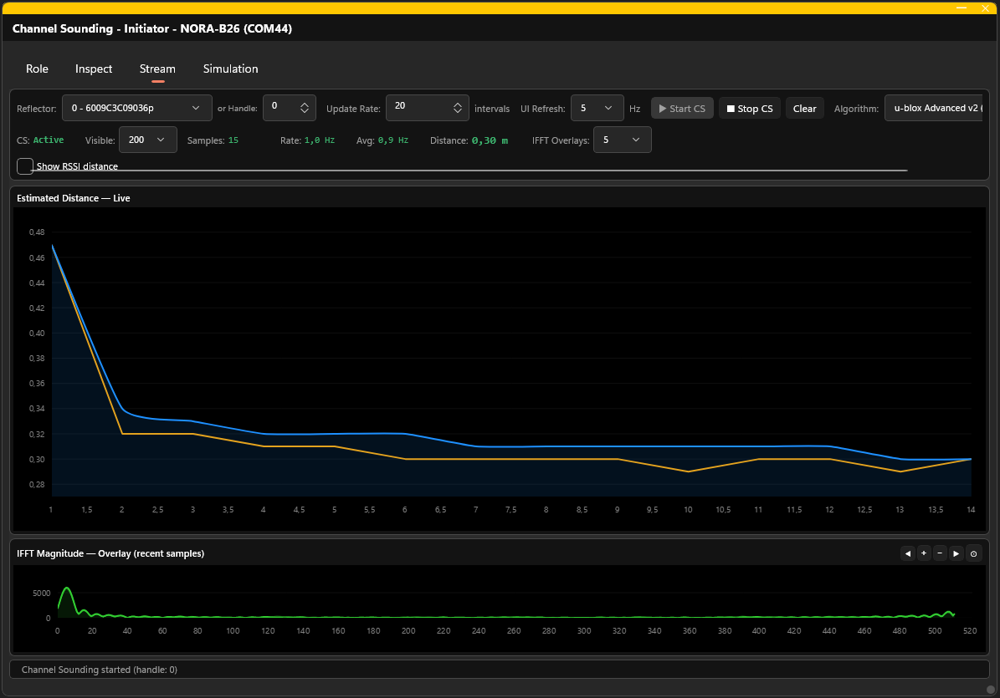

# Channel Sounding Quick Start Guide

Measure the distance between two u-blox Bluetooth LE devices using Channel Sounding in s-center.

## Hardware Requirements

- **Two** u-blox module EVKs with Channel Sounding support (e.g., EVK-NORA-B26)
  - https://www.u-blox.com/en/product/evk-nora-b26
- Two USB cables for connecting the EVKs to your PC (included in each kit)

> **Note:** Channel Sounding requires one device acting as the **Initiator** and one as the **Reflector**. Both must be added as separate products in s-center.

## Prerequisites

- Two u-blox modules with **Bluetooth LE 6.0 + Channel Sounding** capability
- Both modules connected to your PC via USB
- Both modules added as products in s-center

## Steps

### Step 0: Add Both Products in s-center

1. Plug both EVK boards into your PC via USB.
2. In s-center, click **Add Product** and add each device separately.
3. You should see two products in the left sidebar.

> **Note:** Always check so you have the latest firmware on the devices. You can see if there are newer versions available on the right side pane in s-center. Channel sounding was introduced in u-connectXpress v3.4.0 so this is minimum required version.

### Step 1: Connect to Both Devices

Click the **Connect** button for each product in the left sidebar to establish serial connections to both devices.

### Step 2: Configure the Reflector

The Reflector needs to advertise for the Initator to find it so it needs and the Initiator needs to be able look for it so the correct Bluetooth modes needs to be configured.

1. In the product menu for the **Reflector**. Click the **Bluetooth configuration** option.
2. Select **Peripheral** or **Central + Peripheral** mode. 
3. Check the **Persist to flash** checkbox if you want the setting to survive a reboot.
4. Click **Apply**.
5. In the product menu for the **Initiator**. Click the **Bluetooth configuration** option.
6. Select **Central** or **Central + Peripheral** mode. 
7. Check the **Persist to flash** checkbox if you want the setting to survive a reboot.
8. Click **Apply**.

The reflector also needs to advertise the correct services and characteristics for the Initiator to find it. Make sure that advertising is enabled.

1. In the **Bluetooth configuration** widget, select the **Advertising** tab.
2. Enable the Advertising mode to **Legacy Advertising**
3. Scroll down to the bottom of the widget and check the **Persist to flash** checkbox if you want the setting to survive a reboot.
4. Click **Apply and Start Advertising**

Both devices need to allow bonding and they need to have sufficient security levels. For each device:

1. In the **Bluetooth configuration** widget, select the **Security** tab.
2. Enter the following values	
	a. Pairing mode: **Enable**
	b. I/O Capability: 2 - **Display Yes/No**
	c. Security mode: 3 - **Auth. bonding (secure connections)**
3. Check the **Persist to flash** checkbox if you want the setting to survive a reboot.
4. Click **Apply Security Settings**. 

Next, we need to connect two devices. Keep the **Bluetooth configuration** widgets open if your display real estate allows for it. 

1. In the product menu for the **Initiator**. Click the **Bluetooth scan** option.
2. Find the **Reflector** in the list and double click the row item (or single-click the arrow)
3. Press **Connect**

Once connected, we need to bond the devices.

1. Go back to the **Bluetooth configuration** widget, select the **Security** tab. If you closed the widget, just re-open it and select the **Security** tab.
2. Take the address of the **Reflector** device. You can copy this in the **Bluetooth scan** widget or you can see it in the right side panel. 
3. Enter the address in the **Bond with Device** field and click **Bond**. The two devices are no bonded.

This completes the Bluetooth configuration and you can close the open widgets.

### Step 3: Set Up the Reflector

On the device you want to use as the **Reflector**:

1. Open the **Channel Sounding** widget (product menu > Channel Sounding).
2. Go to the **Role** tab.
3. Select **Reflector** from the Channel Sounding Mode drop down.
4. Optionally check **"Persist to flash"** to save across reboots.
5. Click **Apply**.

> **Set up the Reflector first** — it needs to be ready before the Initiator connects.

### Step 4: Set Up the Initiator

On the device you want to use as the **Initiator**:

1. Open the **Channel Sounding** widget.
2. Go to the **Role** tab.
3. Select **Initiator** from the dropdown.
4. Optionally check **"Persist to flash"**.
5. Click **Apply**.

### Step 5: Start Channel Sounding

If you have followed the previous steps the **Reflector** and the **Initiator** are already connected over Bluetooth.

1. Switch to the **Stream** tab in the **Initiator** Channel Sounding widget.
2. Make sure that the **Reflector** is listed in the drop down list. If it is not listed, ensure that the two devices are actually connected. You can do this either in s-center or check the two EVKs whether the blue LEDs are lit.
3. Press the **Start CS** button and you should start to get distance estimations.

You should see:
- **Estimated Distance** chart with raw (orange) and Kalman-filtered (blue) values
- **IFFT Magnitude Overlay** showing the frequency-domain analysis
- **Live HUD** with current status, sample count, and latest distance

### Step 7: Done!

Congratulations! You are now measuring the distance between two Bluetooth LE devices using Channel Sounding.

Try moving the Reflector device closer and further away to see the distance change in real time.

## Tips for repeated Channel Sounding sessions

You do not have to redo all steps above if you want to repeat the Channel Sounding session. If you presisted the settings to flash, then you already have properly configured devices. Next session you only need to do the following:

1. From the **Initator** scan and connect to the **Reflector**
2. Once connected, open the **Channel Sounding** widget and press "Start CS".

## Tips

* Try **Show RSSI Distance**. This will show distance estimations based on signal strength (RSSI). The data is overlaid so you can compare RSSI and Channel Sounding. The algorithm for RSSI is the **Log-distance path loss model**.

## Troubleshooting

| Problem | Solution |
|---------|----------|
| Channel Sounding won't start | Verify both roles are set (Reflector + Initiator), and a bonded BLE connection exists |
| No Reflector in dropdown | Connect to the Reflector via Bluetooth Scan, or enter the handle manually |
| Distance estimate seems wrong | Check signal quality with "Show noise level"; try the other algorithm; reduce multipath interference |
| Stream chart shows no updates | Check CS status in the HUD — click "Start CS" if not active; verify the Reflector is in range |

## What's Next?

- Load and analyze saved IQ data in the **Inspect** tab
- Compare algorithms using the **Simulation** tab with recorded data
- Explore the [AT command reference](https://github.com/u-blox/u-connectXpress) for Channel Sounding AT commands
