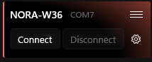
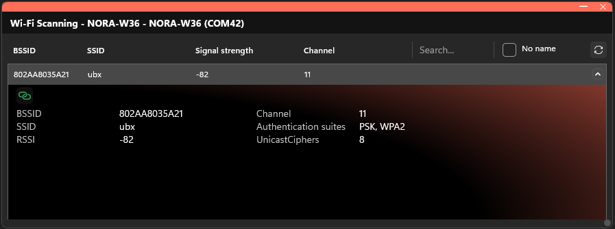
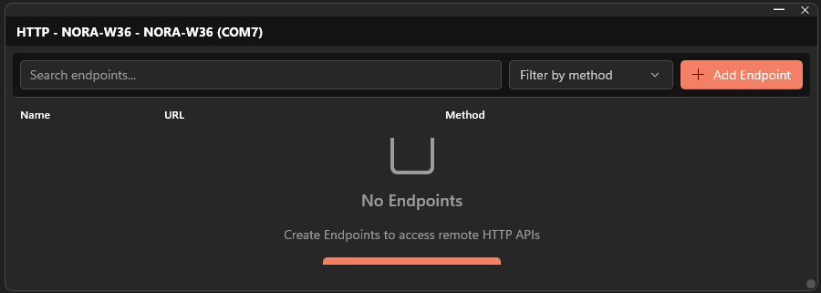
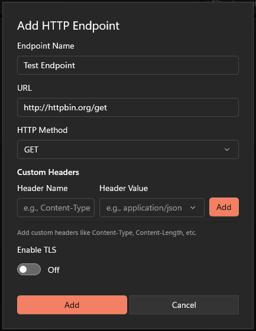
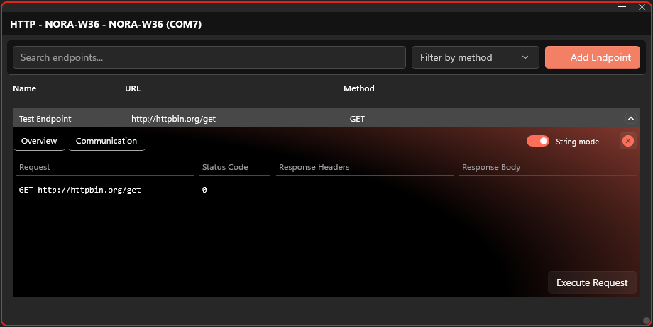
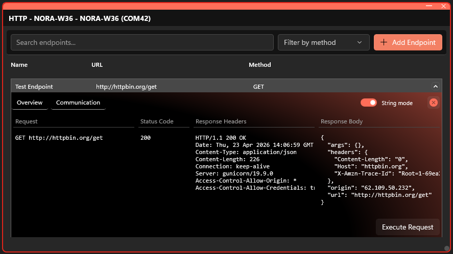
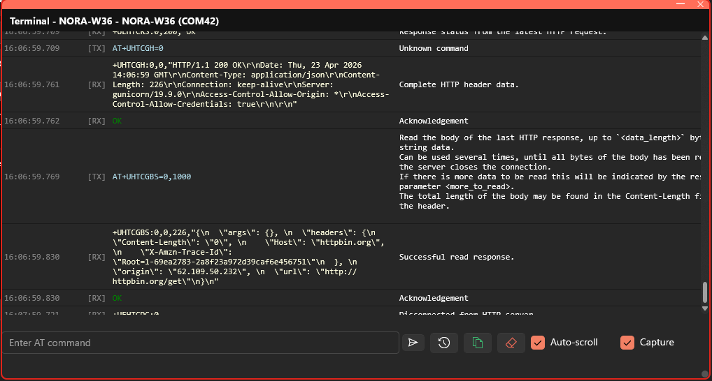

# HTTP Quick Start Guide

Make your first HTTP request from a u-blox module using s-center.

## Hardware Requirements

- A u-blox module EVK with Wi-Fi capability (e.g., EVK-NORA-W36)
  - https://www.u-blox.com/en/product/evk-nora-w36
- A USB cable for connecting the EVK to your PC is included in the kit.
- A Wi-Fi access point with internet access.

## Prerequisites

- A u-blox module with **Wi-Fi capability** (e.g. NORA-W36)
- The module must be connected to your PC via USB
- A Wi-Fi network with internet access

## Steps

### Step 0: Create the product in s-center

1. Plug your u-blox EVK board into your PC via USB.
2. In s-center, click the **Add Product** button in the left sidebar.
3. Keep the default values unless you have previously changed the values on the device.
4. Select your device from the list and click **Add**.

### Step 1: Connect to Your Device

1. s-center will try to automatically connect to the device and open the Terminal widget. If it does not manage to connect you might have wrong configuration. Try to connect manually with the **Connect** button next to your device in the left sidebar.

### Step 2: Connect to Wi-Fi

1. Click the **product menu** next to your device name.
2. Select **Wi-Fi Scan**.
3. Find and connect to your Wi-Fi network (enter the password when prompted).

### Step 3: Open the HTTP Connection Widget

1. Click the **product menu** again.
2. Select **HTTP connection**.

The HTTP Connection widget opens on the canvas.

### Step 4: Create an HTTP Endpoint

1. Click **Add Endpoint** in the HTTP widget.
2. Fill in the endpoint details:
   - **Name:** `Test Endpoint`
   - **URL:** `http://httpbin.org/get`
   - **Method:** `GET`
   - **TLS:** Disabled (uncheck the box)
3. Click **Add**.

### Step 5: Expand Endpoint Details

1. Click the **arrow** next to your endpoint to expand it.
2. Navigate to the **Communication** tab.

### Step 6: Execute the HTTP Request

1. Click the **Execute Request** button.
2. Watch the response appear below.
3. Check the status code — it should be **200 OK**.
4. View the response body from httpbin.org.

You have now successfully sent a HTTP request to a remote server on the internet.

**This completes this guide.**

The **Terminal** widget will show all the AT commands that were sent during the guide.

## What's Next?

- Try different HTTP methods (POST, PUT, DELETE)
- Enable TLS for HTTPS connections
- Create multiple endpoints for different APIs
- Try the [MQTT Quick Start](mqtt-quick-start.md) for pub/sub messaging
